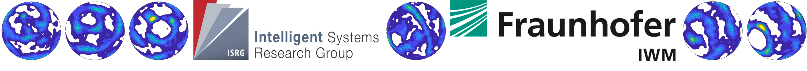

# RL4MicrostructureEvolution
Reinforcement Learning Environments for Structure Guided Process Optimization Tasks

## Prerequisites
- compiled microstructure-path simulation and material model (wil be published seperately)
- Intel Fortran environment to run the simulations and proper environment variables (eg. `export LD_LIBRARY_PATH=$LD_LIBRARY_PATH:/home/<username>/intel/compilers_and_libraries_2019.3.199/linux/compiler/lib/intel64_lin:/home/<username>/intel/compilers_and_libraries_2019.3.199/linux/mkl/lib/intel64_lin`)

## Install and run microstructure-evolution environments
- `cd RL4MicrostructureEvolution`
- `pip install .`
- `cd msevolution_env/examples`
- `python sg_random_agent.py` for single-goal version or `python meg_random_agent.py` for multi-equivalent goal version

## Cite
(preprint under review, this reference wil be changed on acceptance)
```
@article{dornheim2020structure,
  title={Structure-Guided Processing Path Optimization with Deep Reinforcement Learning},
  author={Dornheim, Johannes and Morand, Lukas and Zeitvogel, Samuel and Iraki, Tarek and Link, Norbert and Helm, Dirk},
  journal={arXiv preprint arXiv:2009.09706},
  year={2020}
}
```